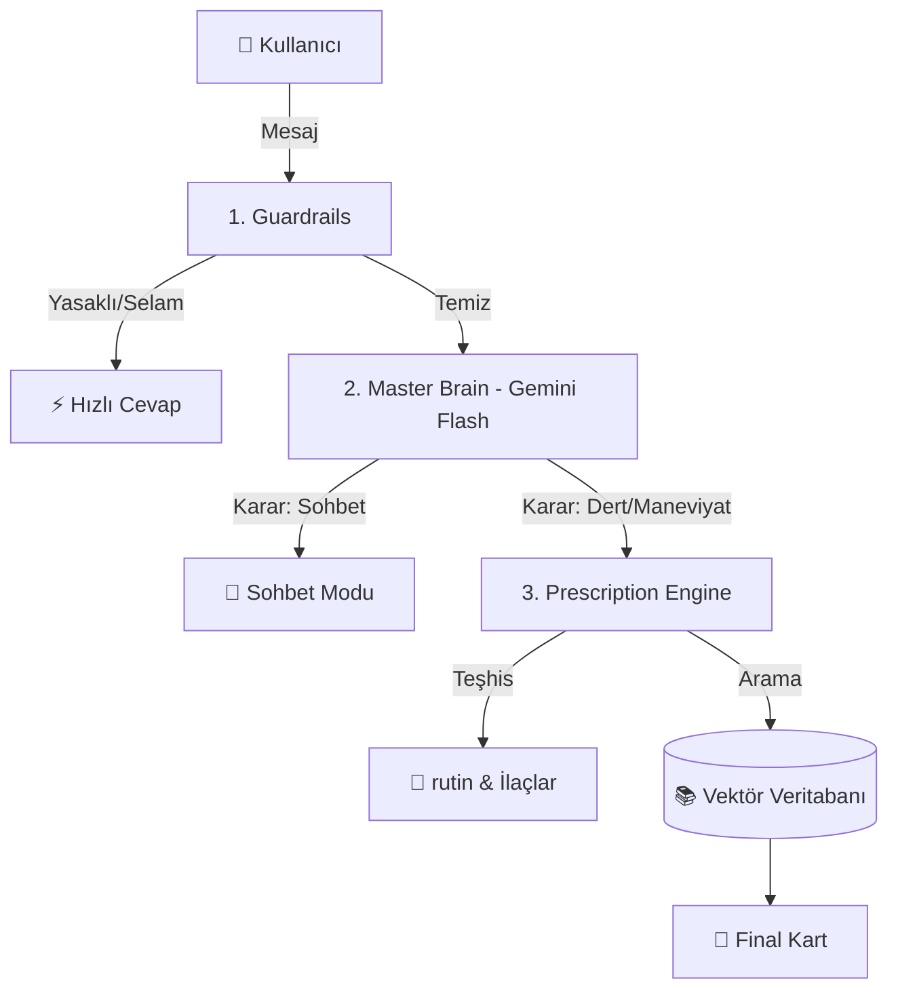

# 🧠 QuranApp: Akıllı Asistan Mimarisi (System Architecture)

Bu doküman, sistemin kullanıcıdan gelen bir mesajı nasıl işlediğini, arka planda hangi kararları verdiğini ve hangi dosyaların çalıştığını **adım adım** açıklar.

---

## 🚦 1. Büyük Resim (The Flow)

Sistem tek bir giriş kapısına sahiptir: **`master_brain.py`**.
Tüm trafik buradan geçer ve **3 Katmanlı Süzgeçten** geçirilir.

---

## 🔍 Adım Adım İşleyiş

### Adım 1: Güvenlik ve Hız Kontrolü (Guardrails)
**Dosya:** `backend/app/services/master_brain.py` → `check_guardrails()`

Mesaj AI'ya gitmeden önce basit bir kelime listesinden geçer.
*   **Amaç:** Maliyeti düşürmek ve güvenliği sağlamak.
*   **Senaryolar:**
    *   `"Selam"` -> **Sistem:** "Selam! Buyrun." (Gemini'ye gitmez, $0 maliyet).
    *   `"Porno"` -> **Sistem:** Bloklar.
    *   `"Kumar"` -> Bloklamaz (Belki tövbe etmek istiyordur), bir sonraki adıma geçer. ✅

---

### Adım 2: Beyin ve Karar (The Master Brain)
**Dosya:** `backend/app/services/master_brain.py` → `decide()`

Mesaj temizse, **Gemini 2.0 Flash** modeline gönderilir. Model bir "Danışma Görevlisi" gibi davranır.
*   **Karar Mekanizması:**
    *   *"Nasılsın?"* -> **INTENT: CHAT**. (Sistem hemen cevabı yapıştırır).
    *   *"Çok bunaldım"*, *"Ayet bul"* -> **INTENT: PRESCRIPTION**. (rutin motoru devreye girer).

---

### Adım 3: Uzman Doktor (The Prescription Engine)
**Dosya:** `backend/app/services/prescription_engine.py`

Eğer konu maneviyat ise bu motor çalışır.
1.  **Teşhis (Diagnosis):** Gemini kullanıcının sözünü değil, **kalbini** okur.
    *   *Girdi:* "Patronum beni kovacak."
    *   *Analiz:* "Kök sebep Rızık Korkusu. İlaç: Tevekkül."
2.  **rutin Yazma:** Doktor, veritabanında aranacak "Anahtar Kelimeleri" belirler (`Rızık`, `Tevekkül`, `Sabır`).

---

### Adım 4: Eczane (Vector Search)
**Dosya:** `backend/app/services/prescription_engine.py` → `retrieve_esma()`, `retrieve_verses()`

Doktorun verdiği anahtar kelimelerle veritabanına gidilir.
*   **Teknoloji:** `gemini-embedding-001` (768 Boyutlu Vektörler) via `ai_service.py`.
*   **İşlem:** Anahtar kavrama matematiksel olarak en yakın Ayet, Hadis ve Esma-ül Hüsna bulunur.

---

### Adım 5: Sentez ve Sunum (Synthesis)
**Dosya:** `backend/app/services/prescription_engine.py` → `synthesize_prescription()`

Bulunan tüm parçalar (Teşhis + Ayet + Dua + Esma) birleştirilir ve kullanıcıya "Manevi rutin Kartı" olarak sunulur.

---

## 📂 Dosya Görev Dağılımı

| Dosya | Görev | Analoji |
| :--- | :--- | :--- |
| **`master_brain.py`** | Karşılayıcı & Yönlendirici | Hastane Danışması |
| **`prescription_engine.py`** | Teşhis & Tedavi Motoru | Başhekim & Cerrah |
| **`search_router.py`** | Hibrit Bilgi Motoru | Kütüphaneci |
| **`ai_service.py`** | Gemini API Merkezi | Laboratuvar |
| **`plan_service.py`** | 7 Günlük Plan Üretici | Fizyoterapist |

Bu mimari sayesinde sistem hem **hızlı**, hem **ekonomik**, hem de **derinlikli** çalışır.
